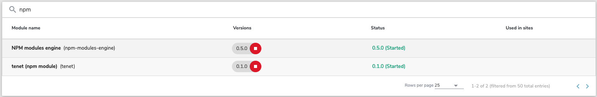
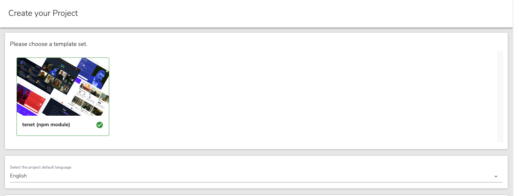

# TENET

A Jahia NPM module created using the NPM module starter project template with a lot of client components to showcase the possibility to use npm libraries instead of the regular JSP files with combination of JS standalone files.


To have a prepared website with already contributed content based on this module, you can check this :
(https://github.com/GladTek/tenet-prepackaged-website)

You can also test the results without compilation by just running a docker container
Procedures are here :
https://github.com/GladTek/jahia-docker-provisioning/tree/8.2/00-jahia-tenet-mariadb

If you are not technical you can ask us for a demo link.

## Dependencies

- Jahia **8.2**
- GraalVM **17** (Jahia does provide this feature only on GraalVM no OpenDK nor OracleJDK)
- NPM-MODULES-ENGINE **0.5.0**

## Compilation & Deployment

> [!IMPORTANT]  
> Make sure your **npm-modules-engine** version is at least **0.5.0** (we are using nearly the latest release with new features and developments) and not the default **0.2.0**


> [!NOTE]  
>For preparation to deployment you need to create an **.env** file from **.env.example**

Use your case of deployment :

**Physical Machine Server :**

JAHIA_DEPLOY_METHOD=curl

JAHIA_USER=user:password

JAHIA_HOST=serverName

**Docker Container :**

JAHIA_DEPLOY_METHOD=docker

JAHIA_DOCKER_NAME=YourDockerContainerName

Next run those command lines :  

```shell
yarn install

yarn build

yarn deploy
```

You will end up having the template as an option for creating new website :



**List of techniques used in this implementation.**

| Aspect                     | Solution                                  |
| -------------------------- | ----------------------------------------- |
| 🛠️ Frameworks, Libraries   | [React], [Webpack]                        |
| 🛠️ CMS                     | [Jahia]                                   |
| 🐚 Application Shell       | [Webpack] [Jahia Appshell]                |
| 🧩 Client-Side Integration | [Module Federation]                       |
| 🧩 Server-Side Integration | Jahia CMS                                 |
| 🎨 Styling                 | Tailwind CSS (A lot of copy paste )       |
| 👩‍💻 Local Development       | [Webpack]                                 |

Current development (at the writing of these lines) of NPM modules engines (0.5.0) are still in alpha, so much change in folder structure.

Some other changes on how to build an URL, static URL are in 0.6.0-SNAPSHOT are not made in this repo.

Feel free to fork, clone, use or enhance the project.
